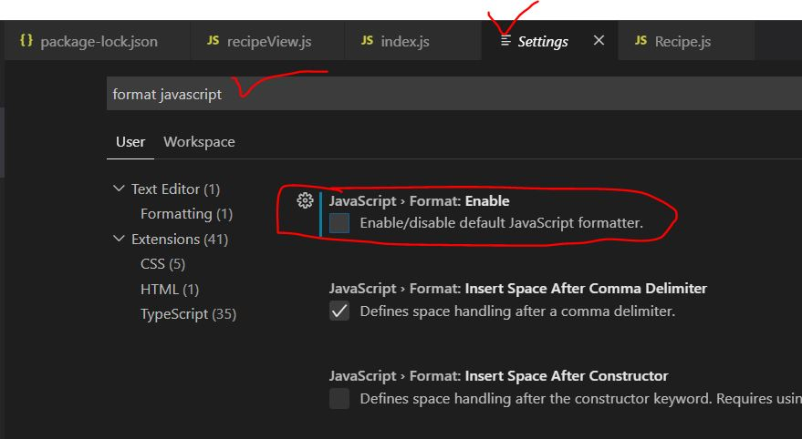
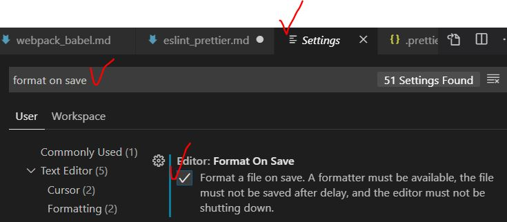

# Prettier 설정

- ### Prettier 란?

  > - 정해진 규칙에 따라 자동으로 **코드 스타일을 정리**해주는 tool
  > - 다른 도구들과의 **주요 차이점**은 코드 정리 규칙을 세부적으로 **custom 설정** 할 수 있다는 점 입니다.

- ### 실행

  - vscode extension 설치
  - vscode default formatter 를 disable 해줘야 실행됨
    
  - F1 -> 'Format Document' 입력 후 선택 : 실행됨
  - 저장 시 자동 Formatting 되도록 설정
    

- ### 설정

  - .prettierrc 파일 생성 : custom 설정 가능

- ### Prettier formatting 무시하는 법

  1. VSCode 전체 :

     > - .prettierignore 생성
     > - setting.json 에 **prettier.ignorePath (default: .prettierignore)** 설정

  2. line 별 무시 :

     > 무시하고자 하는 코드의 윗 라인에 아래 주석 입력
     >
     > - html, markdown :
     >
     > ```
     > <!-- prettier-ignore -->
     > ```
     >
     > - js :
     >
     > ```
     > // prettier-ignore
     > ```
