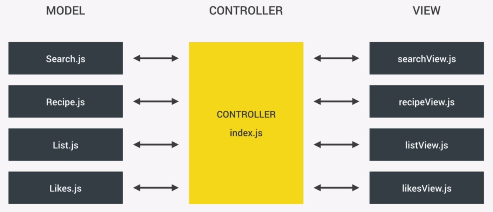

# Forkify
## Recipe 정보 app
- ### Architecture
</img>

- ### Memo
    - #### Array 관련
        > - Array.reduce() : [searchView.js]()
            > [[MDN >>]](https://developer.mozilla.org/ko/docs/Web/JavaScript/Reference/Global_Objects/Array/Reduce)
        > - Array.join() : [searchView.js]()
        > - Array.findIndex(callback fn)  *중요 : [Recipe.js]()
        > - Array.include() : [Recipe.js]()
        > - Array.map()
        > - Array.slice() : [Recipe.js]()

    - event.preventDefault() : [index.js]()
    - Global State Object 사용법
    - DOM 제거하는 법
        > loader.parentElement.removeChild(loader)
        >  -- 부모 요소를 먼저 찾은 후 .removeChild(el) 사용
        >  EL.innerHTML = '';  의 경우 요소에 관계 없이 EL 안의 모든 HTML 을 삭제함 
    - html5 'data-*' 속성   
        > html: \<button class="btn1" data-xx=2>   
        > js: btn1.dataset.xx   // = 2
    - Element.closest() 사용법
    - hash change event [>>]()
        > url 에서 # 부분 값의 변화를 감지함
        > window.addEventListener('hashchange', callback fn)
    - load event [>>]()
        > page 가 load 되는 것을 감지함
        > window.addEventListener('load', callback fn)