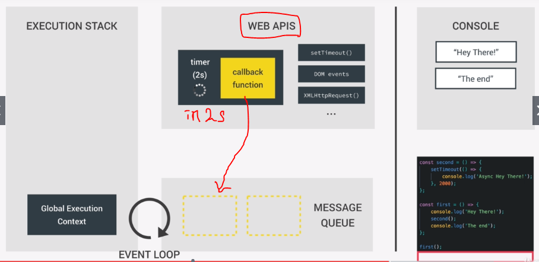

<h1>Asynchronous JavaScript</h1>

<ul>
    <li>
        <h3>WEB API</h3>
         : Execution stack , Message Queue 와 함께 JS runtime 을 구성하는 외부 요소
         : <b>Asynch code(비동기적 코드)</b> 가 대기하는 (<b>timer</b>가 실행되는) background 임
        
        <pre>
            예시)
            - setTimeout()
            - DOM manipulation methods
            - DOM event 의 event listener (callback fn) 가 call을 대기하는 곳
            - XMLHttpRequest()  : ajax 에 쓰임
            - geolocation
            - localStorage
            등등..
        </pre>
        
            WEB API 에서 timer 가 끝이나면 해당 callback fn 은 Message Queue 에서 
            Execution stack 이 비워질 때까지 기다린다. (DOM event 도 마찬 가지) 
        
    </li>
    <li>

    </li>
</ul>