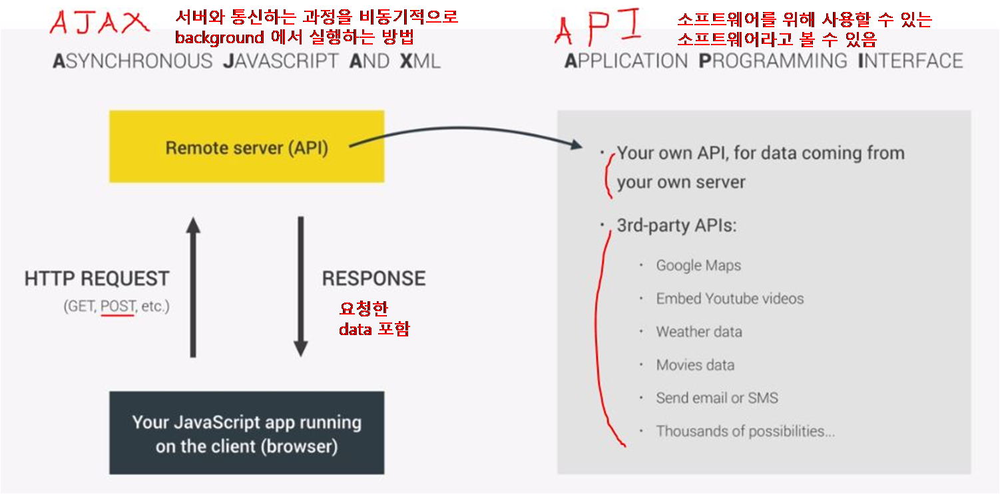

<h1>Asynchronous JavaScript</h1>

<ul>
    <li>
        <h2>WEB API<a href=""> >>></a></h2>
         : Execution stack , Message Queue 와 함께 JS runtime 을 구성하는 외부 요소 
         : <strong>ASYNC code(비동기적 코드)</strong> 가 대기하는 (<strong>timer</strong>가 실행되는) background 임
        <pre>
    Web API 의 종류 : 
    - setTimeout()
    - DOM manipulation methods
    - DOM event 의 event listener (callback fn) 가 call을 대기하는 곳
    - XMLHttpRequest()  : ajax 에 쓰임
    - geolocation
    - localStorage
    등등..
        </pre>
        
            WEB API 에서 timer 가 끝이나면 해당 callback fn 은 Message Queue 로 이동하여 
            <strong>Execution stack 이 비워질 때까지 기다린다.</strong> (DOM event 도 마찬 가지)
         
         <BlockQuote>
            JS runtime 은 background 를 가지고 있어 비동기적 작업이 가능하지만, Execution stack 은 말그대로 Stack 구조이므로 한가지 operation 만 수행 가능 => Execution stack 이 비어져야 비동기 fn도 수행 가능.
        </BlockQuote>
    </li>
    <li>
        <h2>EVENT LOOP</h2>
        
        
            <h6>** 위의 예시는 setTimeout() 가 실행되는 경우이지만 DOM event, Ajax 모두 같은 방법으로 작동한다.**</h6>
        
        <h3>Event Loop 동작 순서 :</h3>
        <ol>
            <li><strong>DOM Event</strong> 는 <strong>WEB API</strong> 에 존재</li>
            <li>Event가 발동되면 <strong>Event Handler(function)</strong> 가 <strong>Message Queue</strong> 로 전달된다.</li>
            <li>Message Queue 에서 <strong>Execution Stack</strong> 이 비워질 때까지 대기</li>
            <li>비워지면 <strong>Event Loop</strong> 이 Handler 를 <strong>Execution Stack</strong> 에 보낸다. => <strong>실행</strong></li>
        </ol>
         
    </li>
    <li>
        <h2>Promises<a href=""> >>></a></h2>
        <a href="">Callback Hell</a>(콜백 지옥) 에 대한 해결책 
        <strong>Asynchronous JS</strong>를 위해 만들어진 ES 6 의 기능
        <BlockQuote>
            <ul> 
                <li>
                    특정한 비동기적 Event ('timer의 종료' 또는 'ajax call 로 data 불러오기' 등) 의 발생 여부를 
                      계속해서 추적하는 객체이다.
                </li> 
                <li>
                    Event 가 발생하면 그 다음 무엇을 할지 결정한다.
                </li> 
                <li>
                    어떤 결과(값)가 실행(전달)될 것인지 우리에게 약속해준다. 
                    (우리는 그것을 통해 값을 미리 사용 가능)
                </li> 
            </ul>
        </BlockQuote>
        <h3>- Promise 의 States (상태)</h3>
        <ol>
            <li>
                <strong>Pending</strong>
            </li>
            <li>
                <strong>Settled / Resolved </strong>
                (event 발생 후)
            </li>
            <li>
                <ul>
                    <li>
                        <strong>Fulfilled</strong> (promise 성공 시 : 즉, 결과가 available)
                    </li>
                    <li>
                        <strong>Rejected</strong> (error 발생 시)
                    </li>
                </ul>
            </li>
        </ol>
        <h3>- Produce , Consume</h3>
        <strong>Produce</strong> : Promise 를 생성하고 <strong>Promise</strong>를 이용해 결과를 보내는 단계 
        <strong>Consume</strong> : Promise 의 <strong>Fulfillment</strong> 와 <strong>Rejection</strong> 각각의 상태에 해당하는 <strong>Callback function</strong> 을 사용하는 단계 
        <blockquote>.then() 과 .catch() => async / await (ES8 ES2017)</blockquote>
    </li>
    <li>
        <h2>AJAX / API<a href=""> >>></a></h2>
        
    </li>
</ul>