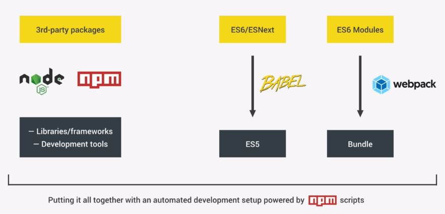

# Modern JavaScript

- ## node.js / npm  ecosystem
    : 3 party open source tool, __libraries, frameworks__ 사용 가능하게 해줌   
    - ### node.js package 두 종류:   
    > __Library, Framework__ :    
    React, Vue, Angular, Lodash, Jquery 등   
    __=> Dependency__  

    > __Development Tools__ :   
    test automation, automatic browser reloading, compile to ES5 등의 역할을 하는 tool 들   
    __=> devDependency__

    

    - ### npm (Node Package Manager) 이란?
        [https://www.npmjs.com/](https://www.npmjs.com/)
        > __node.js 의 package__ (라이브러리, 프레임워크, dev tool = __DEPENDENCY__) 들을 __설치, 공유, 관리__ 해주는 command 기반의 tool   
    
    - ### npm package 대표적인 종류 :

        - __- [Webpack](https://webpack.js.org)__   
        : _ES6 Modules_ 로 인해 JS의 모듈화가 가능해짐   
        (각 part 별로 파일을 나눌 수 있음)   
            >
            > 하지만, 아직 이 기능을 지원하지 않는 browser 가 많음   
            > __=> _Module Bundler_ 사용하여 해결 (대표적: __Webpack__)__
            >
            >__- Webpack 의 기능__
            >- _Bundle Modules_
            >- _Decrease JS bundle size_ (tree shaking 알고리즘 사용)
            >- _Code Splitting_
            >- _Load Assets_ (sass, images 등)   
    
            >[webpack.config.js (_webpack 설정 파일)](webpack.config.js)
            
        - __- [BABEL](https://babeljs.io)__   
        : ES6 / ESNext(7, 8) 를 ES5 로 compile 해주는 tool
            > [babel.config.json (_babel 설정 파일)](babel.config.json)

    - ### npm package 설치방법 :

        1. #### package.json 생성
                ** cmd line 관리자 권한으로실행하기 **
                ** package version 은 최신이 제일 나은 것으로 보임 **
                
                command line 명령어 (프로젝트 폴더에서 입력)
                 $ npm init
                  
                  각 질문에 값 입력 / () 안의 값은 default
                  => package.json 생성됨  (해당 npm 의 정보 기입됨)
                     
                - 다른 컴퓨터에서 프로젝트 실행 시
                 $ npm install
                 => npm 이 package.json 을 확인하여 자동으로 필요한 dependencies(package) 들을 설치함

            - package.json 설명

                    {
                        "name": "forkify",                   // package 명
                        "version": "1.0.0",                  // package 의 현재 버전
                        "description": "forkify project",
                        "main": "index.js",
                        "scripts": {                         // npm scripts : local dev dependency 들을 실행하는 곳

                            "dev": "webpack --mode development",
                            "build": "webpack --mode production",
                            "start": "webpack-dev-server --mode development --open"                          

                                                            // property 값 : npm 실행 문에서 지시어
                                                            // value 값 : 실제 실행되는 지시어
                        },
                        "author": "Seongjin Kim",
                        "license": "ISC",
                        "devDependencies": {                 // locally installed  dev dependency
                                                            // 다음단계에서 package 들을 설치하면 자동으로 채워짐
                                                            
                            "@babel/core": "^7.8.4",                
                            "@babel/preset-env": "^7.8.4",          // babel 의 code convert target 환경을 지정
                            "babel-loader": "^8.0.6",               // 실제 code convert 함

                            "html-webpack-plugin": "^3.2.0",        // html 파일을 dev server 또는 dist 폴더에 
                                                                        // 주입(inject) 시키는 plugin
                            "webpack": "^4.41.6",                   
                            "webpack-cli": "^3.3.11",               // cli : Commandline Interface
                            "webpack-dev-server": "^3.10.3"         // 주입된 파일을 가상의 server 에 stream 하여 
                                                                        // 실시간 업데이트 해줌
                        },
                        "dependencies": {                    // dependency
                            "@babel/polyfill": "^7.8.3"             // polyfill 역할:
                                                                        // es5 에 없는 es6 feature (_promise object,
                                                                        // Array...from 등) 은 convert 가 불가능하므로
                                                                        // es5 로 동일한 기능 구현한 code 주입
                                                                        //
                                                                        // => 직접 code 에 관여하므로 dependency 
                        }
                    }

        2. #### Package 설치
            1. #### Local 설치   
                >해당 프로젝트에서만 package 에 접근 가능함

                - ##### Webpack 설치 (devDependency)
                             $ npm install webpack --save-dev
                             $ npm install webpack-cli --save-dev
                             $ npm install webpack-dev-server --save-dev
                        
                            - --save-dev : webpack 을 프로젝트의 devDependency (only tool) 로   
                                           지정한다는 의미
                                           (package.json 에서 확인 가능)

                            - webpack-cli : command line 에서 webpack 접속하게 해주는 tool  

                            - version 선택하여 설치 (강의 사용 버전):   __ 비권장XX
                             $ npm install --save-dev webpack@4 webpack-cli@2 webpack-dev-server@3                  
                                @ : version 나타냄                       

                            - 삭제 : 
                             $ npm uninstall webpack --save-dev

                - ##### Babel 설치 (devDependency)
                            - 한번에 여러 패키지 설치 
                             $ npm install @babel/core @babel/preset-env babel-loader --save-dev
                            - babel-polyfill 설치 (real dependency 에 속함_ 실제 코드를 생성하는 plugin이므로)
                             $ npm install @babel/polyfill --save   

                            - version 선택하여 설치하는 법 (강의 사용 버전):  __ 비권장XX
                             $ npm install --save-dev babel-core@6 babel-preset-env@1 babel-loader@7
                             $ npm install --save babel-polyfill@6

                    ** babel, webpack 버전 관련 설명 : [udemy 강의](https://www.udemy.com/course/the-complete-javascript-course/learn/lecture/13621430#overview)

                - ##### Jquery 설치 (dependency)
                         $ npm install jquery --save

                        - devDependency 설정은 제외
                        - dependency (직접 사용되는 dependency) 로 지정됨

                - ##### Jquery 삭제
                         $ npm uninstall jquery --save

            2. #### Global 설치   
                >로컬 내 모든 위치에서 접근 가능

                - ##### Live Server 설치 (global)
                    > Live Server : static website server 제공하는 tool
            
                            Windows : 
                             $ npm install live-server --global

                            Mac, Linux : 
                             $ sudo npm install live-server --global

                            프로젝트 외부에서 사용 시 :
                             $ live-server

                            종료 : 
                             $ ctrl + c
    - ### npm package 설정 [>>>](ref/npmCheatsheet.md)

    - ### npm package 실행방법 :
        > package.json 에서 설정한 __npm scripts__ 부분을 사용한다.  
         모든 package를 cmd line 에서 자동으로 실행할 수 있다.

                - webpack 실행
                 $ npm run (scripts 의 property)