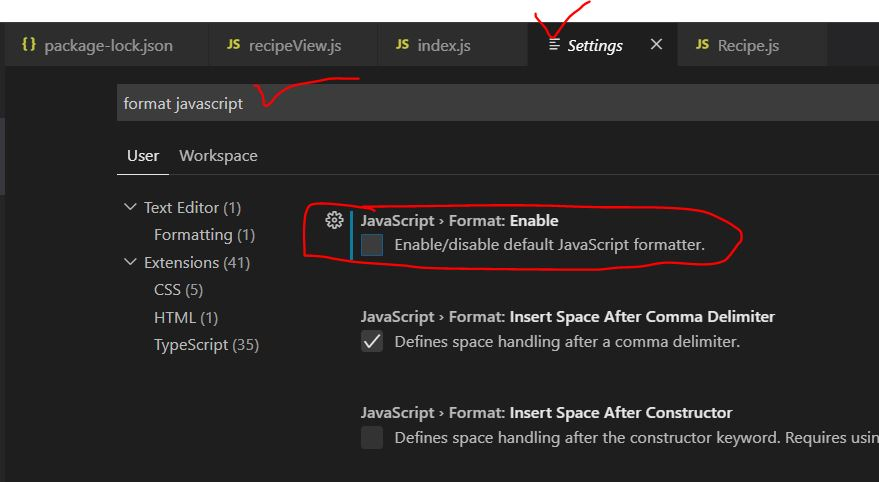
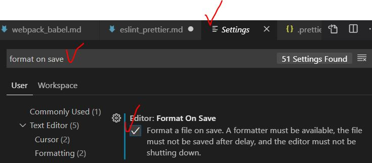

# ESlint 설정

- ### ESlint 란?

  > - javascript **문법검사**를 해주며, 그 문법 검사에 대한 조건에 다양한 옵션을 **custom 설정**할 수 있습니다.
  > - 보통 **library** 로 배포된 유명 문법 설정을 가져다 사용

- ### 실행

  - vscode extension 설치
  - vscode default formatter 를 disable 해줘야 실행됨
    
  - F1 -> 'Format Document' 입력 후 선택 : 실행됨
  - 저장 시 자동 Formatting 되도록 설정
    

- ### 설정
  - [.prettierrc 파일]() 생성 : custom 설정 가능
